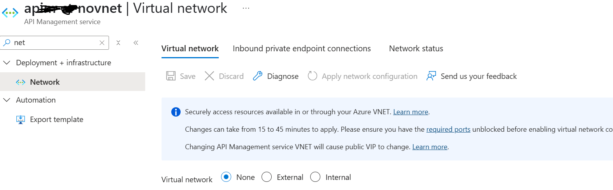
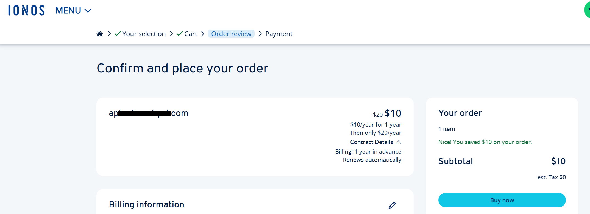
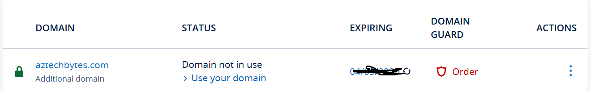
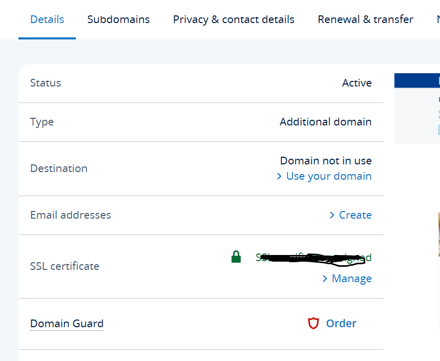
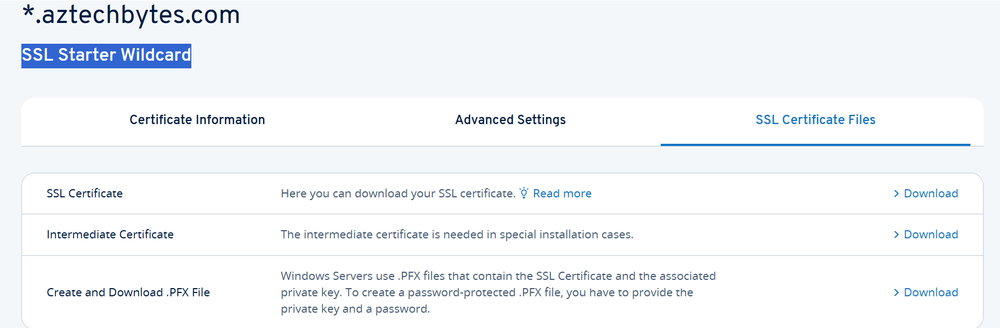
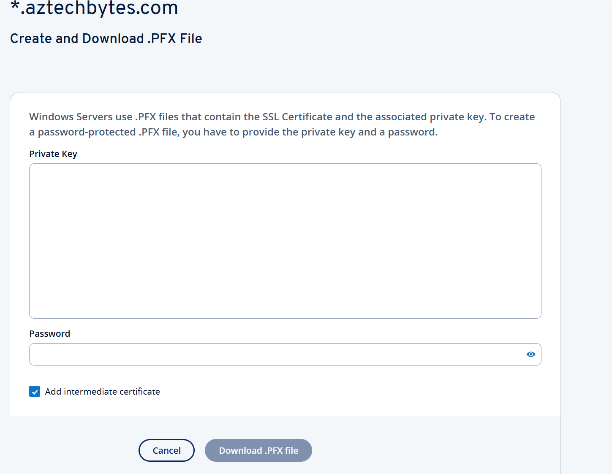
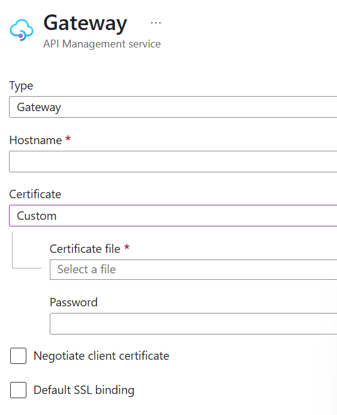
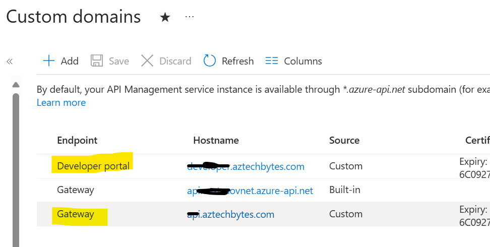

# APIM Custom Domain- Steps To Configure APIM with Custom Domain

## Scenario:
When you create an Azure API Management service instance, Azure assigns a domain of *.azure-api.net like <apim-service-name>.azure-api.net. However, in general you see customers do expose their API Management endpoints using their own custom domain name. This tutorial will show steps by steps how you can procure custom domain and then setup your APIM instance to map the custom domain name.

## Pre-requirements

- Before we start, we could make sure that we have APIM service created
- How to create APIM service [here](https://learn.microsoft.com/en-us/azure/api-management/get-started-create-service-instance).
- Obtain a custom domain name owned by you or your organization.

## Steps:
 
  - To set up a custom domain in Azure API Management (APIM) we should have APIM instance available and obtain a custom domain name.
  - Once done we should have a valid certificate with a public and private key (.PFX) matches the domain name for DNS Configuration. 
  - Later we have to host DNS records on a DNS server to map the custom domain name to the default domain name of your API Management instance. Please follow the document available here which explain how to map an existing custom DNS name to endpoints exposed by an API Management instance. However follow the below steps to capture your domain name and how to map it with your API Management instance. 
	- Create an API Management instance using the steps in the document below. 
  https://learn.microsoft.com/en-us/azure/api-management/api-management-get-started#a-namecreate-service-instance-acreate-an-api-management-instance. For the demo we will be creating APIM for Developer Tier and not using the VNET mode. 

-----

- To purchase the custom domain you can look for various domain name registrars like Namecheap, GoDaddy, Google Domains, or others. However for our demo purpose I am using the IONOS service here. 
    You can also use the Azure App service domain https://learn.microsoft.com/en-us/azure/app-service/manage-custom-dns-buy-domain but I got good discount at https://www.ionos.com/ and able to procure my domain in less than a dollar for a year. 
- To purchase the domain look for the any of the above domain provider or check out the domain name. 
    As of writing this article I don't see any registrars providing free service. The IONOS will take 6-8 hours to confirm the availability of your domain. 
    This is how your order will look like once you created the order it will allow you to create a login for IONOS where you are configure your domain and purchase other products offered.

- Confirm your order and agree on the contract details since it will auto renew, so if you are just using this for testing purpose please check your bill for next year(if you would like to continue or not). 
    This service will provide you free email and other offers however please see fit based on your needs.
- We just need to setup our Custom domain hence I purchase Domain and SSL only option and once domain is available you will receive the email confirmation. This is how your domain registration looks like once your domain is ready to use and you logged in to your IONOS dashboard.
	

- Now the next steps is to generate the SSL certificate for your register domain.
- Select the domain and click the gear icon next to the SSL certificate you want to set up. Then, click Set up SSL certificate. Click Activate now in the SSL Unlimited tile. In the input field, enter the domain to which the certificate should be issued or click in the input field and select the desired domain to generate the certificate.

- Once the certificate is generated click Download Private Key and save the private key to your computer. 
   It's important to have this private key as you may need it in future. However you can Reissue the certificate or download certificate files under tab SSL Certificate files. 
   Since we need PFX files for our APIM instance hence download the .PFX file. 
   To create a password-protected .PFX file, you have to provide the private key and a password. Please do select create intermediate certificate option and provide the private key and password for PFX file.

- Please note that the certificate is required with a public and private key (.PFX) and subject or subject alternative name (SAN) must match the domain name which will enable your API Management instance to securely expose URLs over SSL.
- Now to setup the custom domain go to your APIM instance and select Custom domain blade under Deployment +Infrastructure. Here is a default domain provided my APIM service. To add your custom domain  Click on + Add button

- For the demo purpose I am adding the certificate for my Gateway and Developer portal, the option below is using certificate file directly loading to Azure API management however if you prefer you can select certificate from Key Vault. The host name here for Gateway is api.aztechbytes.com and for developer portal is developer.aztechbytes.com.

- Since I am using custom domain for gateway and developer portal hence I added both under Custom domain. Adding custom domain may take up to 45+ min and your developer SKU will be down for this operation. Once the custom domain updated scessfully you will see the names under your APIM>Custom domain. Now call your APIM endpoint using your custom domain and customize your APIM developer portal.
